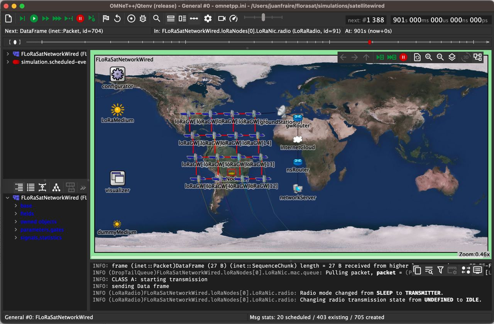

# FLoRaSat

FLoRaSat (Framework for LoRa-based Satellite networks) is an Omnet++ based discrete-event simulator to carry out end-to-end satellite IoT simulations based on LoRa and LoRaWAN adaptations for the space domain. 

A general introduction to the topic is provided in [1]. A description of the early realease of FLoRaSat can be found in [2]. Part of the tool is being developed in the context of the [STEREO](https://project.inria.fr/stereo) ANR project.

- [1] Fraire, Juan A., et al. "[Space-Terrestrial Integrated Internet of Things: Challenges and Opportunities](https://hal.science/hal-03789116v1)." IEEE Communications Magazine (2022).

- [2] Fraire, Juan A., et al. "[Simulating LoRa-Based Direct-to-Satellite IoT Networks with FLoRaSat](https://hal.science/hal-03698223v2)." 2022 IEEE 23rd International Symposium on a World of Wireless, Mobile and Multimedia Networks (WoWMoM). IEEE, 2022.

- [3] Choquenaira-Florez, Alexander Y. et al. "[FLoRaSat 2: Simulating Cross-Linked Direct-to-Satellite IoT LEO Constellations with Joint Access and Routing Evaluation](https://hal.science/hal-05424077v1)." Wiley International Journal of Satellite Communications and Networking (2025).

The FLoRaSat simulator is based on an extended version of [FLoRa](https://flora.aalto.fi/), [leosatellites](https://github.com/Avian688/leosatellites), [OS3](https://github.com/inet-framework/os3), and [INET](https://inet.omnetpp.org/) integrated in a single [Omnet++](https://omnetpp.org/) framework to provide an accurate simulation model for space-terrestrial integrated IoT.

*Please consider the the simulator is under active development, and it should **not** be considered a final stable (or documented) version at the moment. Please reach us at [juan.fraire@inria.fr](juan.fraire@inria.fr) if interested in joining the developers team.* 

Currently, we support a single sample scenario comprising 16 satellites in a grid-like formation (realistic orbital parameters), passing over a circular region with up to 1500 nodes. However, some flexibility can already be leveraged based on the features listed below.

## Features

(UD = Under Development, TD = To-do roadmap)

- **Ground IoT Device**
	- Platform
		- Energy model
		- Clock drift model (TD)
        - Localization model (TD)
    - PHY: LoRa
    	- Free-Space channel model (from INET)
    	- Antena models (from INET: omni, monopole, parabolic, etc.)
    	- Sensitivity model
    	- Doppler effect model (available, but not integrated TD)
    	- Spreading Factors (configurable and fixed per node)
    	- Capture effect (TD)
    - MAC: LoRaWAN
    	- Class A (from FLoRa)
    	- Class B (downlink beacon only, uplink TD)
    	- Class C (TD)
    	- [Class S](https://hal.laas.fr/hal-03694383) (time-slotted Class B extension, downlink beacon only, uplink TD)
    	- [FSA](https://ieeexplore.ieee.org/document/8855903) Frame-Slotted ALOHA Game (leveraging network size estimation)
    	- ADR (TD)
    - MAC/PHY: LR-FHSS (UD)

- **Satellite Gateway**
	- Platform
		- Orbital propagation with SGP4 (LEO and GEO) (from leosatellites)
		- Orbital propagation with SDP4 (GEO) (TD)
		- Support for Keplerian orbital parameters
		- Support for TLE (UD)
		- Attitude control: Nadir-aligned
		- Constellation creation (Walker Star and Walker Delta)
		- EventModule (Scenario scripting, enable/disable ISL at given timestamps)
	- Inter-Satellite Link
		- Cabled (mimick P2P links)
		- Radio (UD, draft version available)
		- Topology control (UD)
		- Dynamic link creation/destruction
			- Constellation-based (constraints: ISL device status, satellite directions, is adjacent sat, latitude)    
			- Contact Plan-based (read from topology file)
		- Dynamic link latency update
	- Routing
		- Generic routing interface (UD)
		- Packet queue and configurable processing delay    
		- Mesh routing 
			- [DisCoRoute](https://ieeexplore.ieee.org/abstract/document/9914716) (UD by R. Ohs)
			- [DDRA](https://ieeexplore.ieee.org/document/7023604) (UD by R. Ohs)    
		- Delay-Tolerant routing 
			- [CGR](https://www.sciencedirect.com/science/article/abs/pii/S1084804520303489) based on Rev 17 from [DtnSim](https://bitbucket.org/lcd-unc-ar/dtnsim) (UD by S. Montoya)
			- Contact Plan generation (TD by S. Montoya)
			- Storage model (UD by S. Montoya)

- **Ground Segment**
	- Ground Station-to-Satellite Link
		- Cabled (mimick P2P links)
		- Radio (TD)
		- Topology control (UD)
			- Dynamic link creation/destruction
			- Constellation-based (constraints: min elevation)   
			- Contact Plan-based (read from topology file)
		- Dynamic link latency update
	- Internet
		- From INET
	- Network Server
		- Lora/LoRaWAN Network server (from FLoRa)

## Installation

1. Install OpenSSL with `sudo apt-get install libssl-dev`

2. Install [OMNeT++6.3.0](https://doc.omnetpp.org/omnetpp/InstallGuide.pdf). Tips:

    * Set the omnetpp environment permanently with `echo '[ -f "$HOME/omnetpp-6.3.0/setenv" ] && source "$HOME/omnetpp-6.3.0/setenv"' >> ~/.profile`

    * Remember to compile with `make -j8` to take advantage of multiple processor cores

    * If **ERROR: /home/diego/omnetpp-6.3.0/bin is not in the path!**, add it by entering `export PATH=$HOME/omnetpp-6.3.0/bin:$PATH`

    * If **ERROR: make: xdg-desktop-menu: No such file or directory** do `sudo apt install xdg-utils`
    
3. Launch omnetpp from the terminal with `omnetpp` and choose a workspace for project (default is `$HOME/omnetpp-6.3.0/samples`)

4. Go to **Help >> Install Simulation Models...** menu and install **INETv4.5.x** in the workspace

5. Execute `git clone https://gitlab.inria.fr/jfraire/florasat.git` in the workspace

6. Add INETv4.3 to the environment by executing florasat/setinet.sh passing the absolute path to the INET root directory, eg. `sh setinet.sh $HOME/omnetpp-6.3.0/samples/inet4.5`

7. In omnetpp go to **File >> Open Projects from File System** and add florasat project to the workspace. If this is not working, you can do **File >> Import... >> General >> Projects from Folder or Archive**

8. Right-click florasat project and go to *Properties*, under *Project References* select inet4.5 (only)

9. Finally, right-click florasat and Build Project

10. If you have files that are considered by Git as modified when they are not, execute `git config core.filemode false` in the local repository.

## Execution of experiments in FLoRaSat

  They ini files are saved are saved in: '/simulations/routing'

  The Ini files used in the article are: 
  - Regular-Iridium.ini
  - Failure-StarLink.ini

## Execution FLoRaSat-CLI
   Use the help command to view a description of the necessary parameters for each command.

  - Install florasatcli from Source. Ensure that florasatcli is installed from the source code before proceeding.
  - Set Up the Configuration File: Initialize the configuration file using the following command:
	
	* 'florasat config init'

	This will generate a .toml file specifying the path where florasat simulation results will be stored and the number of simulation runs.

  - Preprocess Routes and Satellites: Before generating statistics, preprocess the satellites and routes data using the 
    following commands:

	* florasat statistics --cstl Iridium --name Regular --algs DDRA Directed --run 1 --preprocess-satellites  
	* florasat statistics --cstl Iridium --name Regular --algs DDRA Directed --run 1 --preprocess-routes  

	Each parameter can be explored using the -h (help) option.

 - Generate Statistics: Run the following command to execute the simulation and generate statistics:	
	* florasat statistics --cstl Iridium --name Regular --algs DDRA Directed --run 1 --all  

